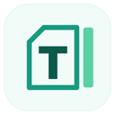

<p align="center">
  
</p>

<h1 align="center">TensorNote for VS Code</h1>

<p align="center">在 VS Code 中阅读 Markdown、展开推导，并用原生 Jupyter Notebook 运行实验。</p>

<p align="center">
  <a href="docs/USER_GUIDE.zh-CN.md">中文使用手册</a> ·
  <a href="docs/ARCHITECTURE.md">架构说明</a> ·
  <a href="CHANGELOG.md">更新记录</a> ·
  <a href="README.en.md">English</a>
</p>

TensorNote 是一个 Markdown-first 的科研学习 Workspace 插件。它只增强 VS Code，不替代 VS Code：文件仍由 Explorer 管理，检索使用 Search，版本控制使用 Git，Python 环境由 Python 扩展管理，Kernel 与执行由 Microsoft Jupyter 扩展管理。

## 核心能力

- **TensorNote Reader**：以 Custom Editor 渲染 Markdown、数学公式、Mermaid、代码、图片和 Callout。
- **Workspace 模式**：根据 Workspace 设置、`tensornote.yaml` 或 Markdown Sidecar 自动识别 TensorNote Workspace。
- **Derivation Sidecar**：点击后在编辑器右侧显示 Markdown 推导或补充材料。
- **Jupyter Sidecar**：转换为右侧原生 VS Code Notebook；TensorNote 不创建 Kernel，也不管理 Python 环境。
- **状态中心**：Activity Bar 展示 Workspace、笔记数、Reader 模式及 Sidecar/Jupyter 状态。
- **PDF 输出**：生成无执行副作用的打印预览，再通过系统打印对话框保存 PDF。

## 安装

TensorNote 已发布到 VS Code Marketplace。推荐在 VS Code 中打开 **扩展**，搜索 **TensorNote**，确认扩展标识符为 `aaronchou313.tensornote-vscode`，然后点击 **安装**。

- [打开 VS Code Marketplace 页面](https://marketplace.visualstudio.com/items?itemName=aaronchou313.tensornote-vscode)
- 离线安装可从 [GitHub Releases](https://github.com/AaronChou313/tensornote-vscode/releases/latest) 下载 `.vsix`，再选择 **扩展 → … → 从 VSIX 安装…**。

命令行安装本地 VSIX：

```bash
code --install-extension tensornote-vscode-0.3.1.vsix --force
```

安装或升级后执行 **Developer: Reload Window**。

若要使用 Jupyter Sidecar，请另外安装 Microsoft 的 **Python** 与 **Jupyter** 扩展。普通阅读与 Derivation 不需要 Python。

## 三分钟开始

1. 用 VS Code 打开一个文件夹。
2. 在根目录添加 `tensornote.yaml`，或在 Markdown 中加入 `:::tensornote` Sidecar。
3. 打开 Markdown，使用编辑器标题栏的书本按钮、命令面板中的 **TensorNote: Open Current File**，或 **Open With → TensorNote Reader**。
4. 点击正文中的 Derivation 卡片，在右侧阅读推导。
5. 点击 Jupyter 卡片，在右侧原生 Notebook 中选择 Kernel，再按需运行 Cell。

最小 `tensornote.yaml`：

```yaml
schemaVersion: 1
workspace:
  name: My Research Notes
content:
  root: notes
assets:
  root: assets
features:
  executable: false
```

## Workspace 默认 Reader

插件不会全局接管 Markdown。普通项目继续使用 VS Code 默认 Markdown 编辑器。

在 TensorNote Activity Bar 中选择 **Use Reader by Default**，或在当前 Workspace 的 `.vscode/settings.json` 中设置：

```json
{
  "tensornote.defaultReader": true
}
```

插件只会为当前 Workspace 维护 `*.md → tensornote.reader` 关联；切换回手动 Reader 后会移除由 TensorNote 管理的关联。

## Sidecar 示例

Derivation：

````markdown
:::tensornote{type="derivation" id="bayes-proof" title="贝叶斯公式推导"}
这里可以写 Markdown、LaTeX 公式、表格和图片。
:::
````

Jupyter：

````markdown
:::tensornote{type="jupyter" id="normal-sample" title="正态分布采样"}
```python title="生成样本"
import numpy as np

samples = np.random.normal(size=1_000)
samples.mean(), samples.std()
```
:::
````

目前只支持 `derivation` 与 `jupyter` 两种 Sidecar。Markdown 文件始终是唯一的可移植数据来源；Notebook 输出只保留在当前 VS Code 会话中，不会回写 Markdown。

## 配置

所有核心配置都按 Workspace/Workspace Folder 读取，不使用用户全局值激活 TensorNote：

| 设置 | 默认值 | 作用 |
| --- | --- | --- |
| `tensornote.enabled` | 自动 | `true` 强制启用，`false` 禁用，未设置时自动检测 |
| `tensornote.defaultReader` | `false` | 当前 Workspace 默认用 TensorNote Reader 打开 Markdown |
| `tensornote.sidecar.enabled` | `true` | 显示 Derivation 与 Jupyter Sidecar |
| `tensornote.jupyter.enabled` | `true` | 允许打开 Jupyter Sidecar |
| `tensornote.reader.maxWidth` | `920` | Reader 内容最大宽度，范围 640–1400 px |

完整操作、权限说明与故障排查请阅读[中文使用手册](docs/USER_GUIDE.zh-CN.md)。

## 开发

```bash
pnpm install
pnpm check
pnpm package
```

本项目是独立扩展仓库，不依赖 TensorNote Desktop 源码或包。发行流程见[发行维护说明](docs/RELEASING.md)。

## 许可证

[Apache License 2.0](LICENSE)
